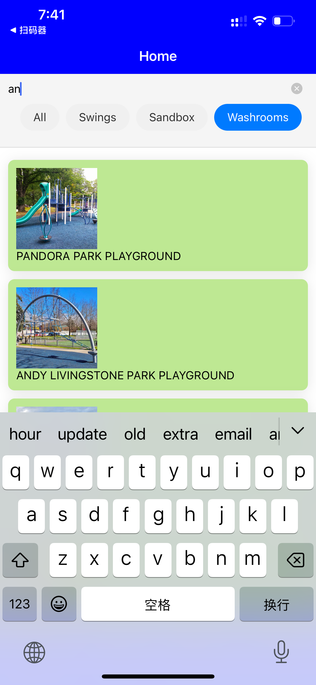

# PlaySpot App

## Overview

The PlaySpot App is a React Native application that allows users to create, manage, and archive plans for visiting playgrounds in Vancouver areas. Users can also create memories of their visits and view details about each playground.

## Features

- Create, update, and delete plans.
- Archive plans and create memories.
- View details of plans and memories.
- Search and select playgrounds.
- Collect playgrounds into favorites.
- Real-time updates using Firestore.

## Data Model and Collections

### Data model
The app uses three main collections that are interconnected through the playgroundId and owner fields:

#### Entity Relationships
- Plans and Memories are linked to specific Playgrounds through `playgroundId`
- Plans, Memories and Favorites are associated with users through `owner`
- When a Plan is archived, it generates a new Memory record

#### Data Flow
1. Users can create Plans for visiting Playgrounds
2. When a Plan is completed, it can be archived into a Memory
3. Users can mark Playgrounds as Favorites at any time

#### Data Constraints
- Each Plan must have a valid `playgroundId` and `owner`
- One user can have multiple Plans, Memories, and Favorites
- One Playground can be associated with multiple Plans, Memories, and Favorites

### Collections (Iteration 1 Version)

#### Plans Collection
- **Fields**:
  - `planName`: string
  - `playgroundId`: string
  - `time`: timestamp
  - `reminderTime`: timestamp
  - `archived`: boolean
  - `owner`: string
- **Description**: Stores details of the plans created by users.

#### Memories Collection
- **Fields**:
  - `memoryName`: string
  - `playgroundId`: string
  - `time`: timestamp
  - `memo`: string (optional)
  - `photo`: string (optional) (TO BE ADDED)
  - `owner`: string
- **Description**: Stores memories created by users.

#### Favorites Collection
- **Fields**:
  - `playgroundId`: string
  - `addedAt`: timestamp
  - `owner`: string
- **Description**: Stores favorite playgrounds added from the playground list.

### Refernce Data
#### Playgrounds Collection (stored locally `data/playgrounds.json`)
- **Fields**:
   - `id`: string
   - `name`: string
   - `address`: string
   - `images`: array of strings
   - `description`: string
   - `features`: map
   - `environment`: map
   - `amenities`: map
   - `special_notes`: array of strings
- **Description**: Stores playground information including details about features, environment, and amenities for display, save favorites and create plans.

## CRUD Operations

### Plans Collection
- **Create**: Implemented in `ModifyPlanScreen.js` using the `writeToDB` function.
- **Read**: Implemented in `PlanList.js` using Firestore queries and `onSnapshot` for real-time updates.
- **Update**: Implemented in `ModifyPlanScreen.js` using the `updateDB` function.
- **Delete**: Implemented in `PlanDetailsScreen.js` using the `deleteFromDB` function.

### Memories Collection
- **Create**: Implemented in `PlanDetailsScreen.js` when archiving a plan using the `writeToDB` function.
- **Read**: Implemented in `MemoryScreen.js` using Firestore queries and `onSnapshot` for real-time updates.
- **Update**: Implemented in `MemoryDetailsScreen.js` using the `updateDB` function.
- **Delete**: Implemented in `MemoryDetailsScreen.js` using the `deleteFromDB` function.

### Favorites Collection (Create, Read and Delete only)
- **Create**: Implemented in `PlaygroundDetailScreen.js` when clicking the favorite button on the upper right corner, using the `writeToDB` function.
- **Read**: Implemented in `FavoriteListScreen.js` using Firestore queries and `onSnapshot` for real-time updates.
- **Delete**: Implemented in `FavoriteListScreen.js` when clicking the remove button and `PlaygroundDetailScreen.js` when clicking the favorite button again the upper right corner, using the `deleteFromDB` function.

## Team Contributions - Iteration 1

- **Member 1 Xinyu Xie**:
   - Architecture & Planning:
      - Redesigned project architecture and created team prototypes.
      - Established development standards and project structure.
   - Setup:
      - Initialized React Native project structure.
      - Implemented core navigation `navigation` folder and `App.js`.
      - Configured Firebase/Firestore integration in `firebase` folder.
      - Implemented data scraping for playground information in `data` and `Service`.
      - Implemented authentication system.
   - Screens:
      - Implemented the components in `home` and `playground` screen folder to display playground relevant screens with search, filter, and favorite toggle functionality.
      - Implemented the `FavoriteListScreen` component to display and delete favorite playgrounds.
      - Implemented the screens in `Account` component for authenticated and non-authenticated states.
   - Others:
      - Added CRD operations for the `Favorites`collection.
      - Updated the README.
      - Styling improvements.

- **Member 2 Yuting Xie**:
   - Architecture & Planning:
      - Refactored the interaction logic of the `Plan Details` screen and creation method of the `memory` collection.
   - Setup:
      - Initialized reusable components like `Screen`, `PressableButton`, and `Card`.
      - Set up the data structures of the `plan` and `memory` collection.
   - Screens:
      - Implemented the components in `Plan` and `Memory` screens to display plans and memories.
      - Implemented the `PlanDetailsScreen` component to display and edit memory details.
      - Implemented the `MemoryDetailsScreen` component to display and edit memory details.
      - Added CRUD operations for the `plan` and `memory` collection.
   - Others:
      - Updated the README with contributions and screenshots.
      - Styling improvements.

## Team Contributions - Iteration 2

- **Member 1 Xinyu Xie**:
   - UI/UX Improvements:
      - Revamped overall application styling
      - Redesigned `HomeScreen` layout and display
      - Enhanced `PlaygroundDetailScreen` layout
      - Optimized `PlanScreen` layout for better presentation
   - Authentication & Security:
      - Implemented Redux for state management, focusing on authentication
      - Added auth-based conditional rendering and access control
      - Updated Firebase security rules
      - Restricted user data access to authorized users only
   - External APIs:
      - Added Google Geocoding API for address-to-coordinates conversion
      - Integrated OpenWeather API for 5-day weather forecasts
      - Implemented weather display logic with service limitations
   - Notifications:
      - Implemented plan notifications with push messaging combined with reminders
      - Improved plan timing and reminder logic in modify plan feature
   - Others:
      - Updated the README

- **Member 2 Yuting Xie**:


## Screenshots

- **Home Screen(Playground list)**

<div style="display: flex; justify-content: space-around;">
  
  
</div>


- **Playground Details Screen**

<div style="display: flex; justify-content: space-around;">
  
  
  
</div>

- **Plan Screen**

<div style="display: flex; justify-content: space-around;">
  
  
  
  
</div>

<div style="display: flex; justify-content: space-around;">
  
  
</div>

- **Memory Screen**
<div style="display: flex; justify-content: space-around;">
  
  
  
</div>

- **Account Screen**
<div style="display: flex; justify-content: space-around;">
  
  
</div>

- **Favorite List Screen**
<div style="display: flex; justify-content: space-around;">
  
  
</div>

- **Firebase Database Screen**
<div style="display: flex; justify-content: space-around;">
  
  
  
</div>


## Firebase Settings
- **Firebase Database Indexes**
Composite query when read data for plan screen
<div style="display: flex; justify-content: space-around;">

</div>


## External APIs
- **Open Weather APi**
   - EXPO_PUBLIC_weatherAPI="01f4b1e258efb2fe82eda4263f4691fa"
- **Google Map APi**
   - EXPO_PUBLIC_GOOGLE_API: We reuse the same google map API in the class activities, and I will teams TAs my api key in case they need mine.


## Getting Started

### Prerequisites

- Node.js
- Expo CLI
- Firebase account

### Installation

1. Clone the repository:
   ```sh
   git clone https://github.com/beibeixx/PlaySpot.git
   cd PlaySpot
   ```

2. Install dependencies:
   ```sh
   npm install
   ```

3. Set up Firebase:
   - Create a Firebase project.
   - Add your Firebase configuration to `firebaseSetup.js`.

4. Start the app:
   ```sh
   expo start
   ```

## Usage

- Create a new plan by navigating to the "Modify Plan" screen.
- View upcoming and past plans on the "Plan" screen.
- Archive plans to create memories.
- View and edit memories on the "Memory" screen.