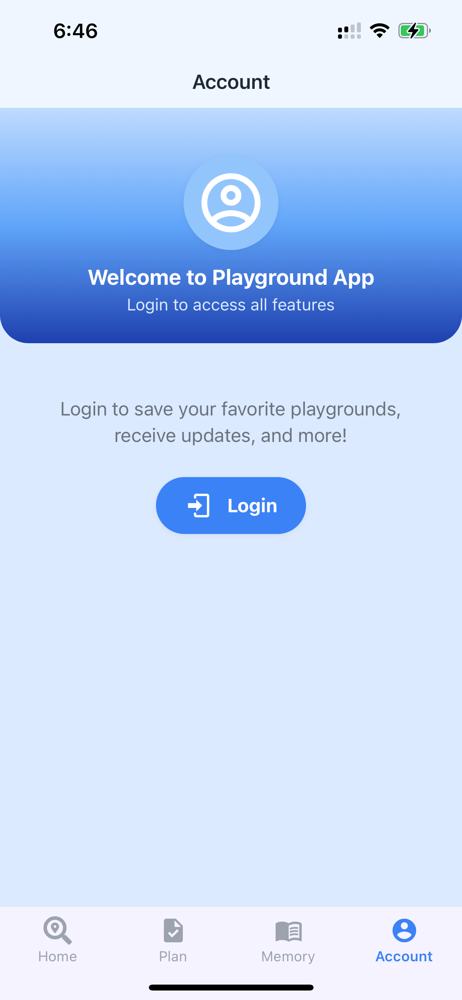
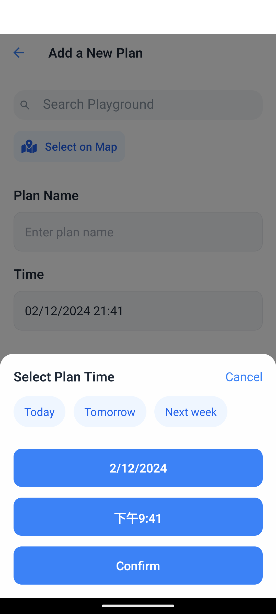
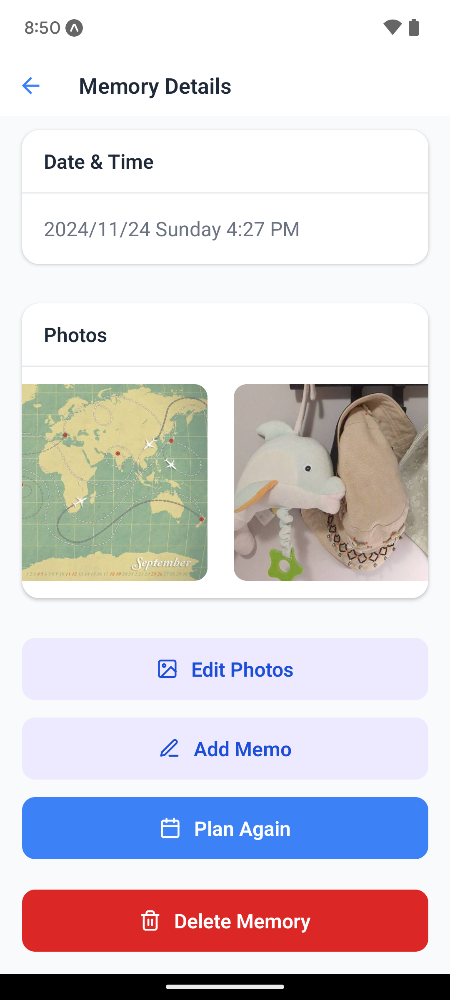

# PlaySpot App

## Overview

The PlaySpot App is a React Native application that allows users to create, manage, and archive plans for visiting playgrounds in Vancouver areas. Users can also create memories of their visits and view details about each playground.

## Features

- Create, update, and delete plans.
- Archive plans and create memories.
- View details of plans and memories.
- Search and select playgrounds.
- Collect playgrounds into favorites.
- Real-time updates using Firestore.

## Data Model and Collections

### Data model
The app uses three main collections that are interconnected through the playgroundId and owner fields:

#### Entity Relationships
- Plans and Memories are linked to specific Playgrounds through `playgroundId`
- Plans, Memories and Favorites are associated with users through `owner`
- When a Plan is archived, it generates a new Memory record

#### Data Flow
1. Users can create Plans for visiting Playgrounds
2. When a Plan is completed, it can be archived into a Memory
3. Users can mark Playgrounds as Favorites at any time

#### Data Constraints
- Each Plan must have a valid `playgroundId` and `owner`
- One user can have multiple Plans, Memories, and Favorites
- One Playground can be associated with multiple Plans, Memories, and Favorites

### Collections

#### Plans Collection
- **Fields**:
  - `planName`: string
  - `playgroundId`: string
  - `time`: timestamp
  - `reminderTime`: timestamp (optional)
  - `archived`: boolean
  - `owner`: string
  - `notificationId`: string
- **Description**: Stores details of the plans created by users.

#### Memories Collection
- **Fields**:
  - `memoryName`: string
  - `playgroundId`: string
  - `time`: timestamp
  - `memo`: string (optional)
  - `photo`: Array of strings (optional)
  - `owner`: string
- **Description**: Stores memories created by users.

#### Favorites Collection
- **Fields**:
  - `playgroundId`: string
  - `addedAt`: timestamp
  - `owner`: string
- **Description**: Stores favorite playgrounds added from the playground list.

#### User Collection
- **Fields**:
  - `avatar`: string
  - `email`: string
  - `nickname`: string
  - `uid`: String
- **Description**: Stores user's info.

### Refernce Data
#### Playgrounds Collection (stored locally `data/playgrounds.json`)
- **Fields**:
   - `id`: string
   - `name`: string
   - `address`: string
   - `images`: array of strings
   - `description`: string
   - `features`: map
   - `environment`: map
   - `amenities`: map
   - `special_notes`: array of strings
- **Description**: Stores playground information including details about features, environment, and amenities for display, save favorites and create plans.

## CRUD Operations

### Plans Collection
- **Create**: Implemented in `ModifyPlanScreen.js` using the `writeToDB` function.
- **Read**: Implemented in `PlanList.js` using Firestore queries and `onSnapshot` for real-time updates.
- **Update**: Implemented in `ModifyPlanScreen.js` using the `updateDB` function.
- **Delete**: Implemented in `PlanDetailsScreen.js` using the `deleteFromDB` function.

### Memories Collection
- **Create**: Implemented in `PlanDetailsScreen.js` when archiving a plan using the `writeToDB` function.
- **Read**: Implemented in `MemoryScreen.js` using Firestore queries and `onSnapshot` for real-time updates.
- **Update**: Implemented in `MemoryDetailsScreen.js` using the `updateDB` function.
- **Delete**: Implemented in `MemoryDetailsScreen.js` using the `deleteFromDB` function.

### Favorites Collection (Create, Read and Delete only)
- **Create**: Implemented in `PlaygroundDetailScreen.js` when clicking the favorite button on the upper right corner, using the `writeToDB` function.
- **Read**: Implemented in `FavoriteListScreen.js` using Firestore queries and `onSnapshot` for real-time updates.
- **Delete**: Implemented in `FavoriteListScreen.js` when clicking the remove button and `PlaygroundDetailScreen.js` when clicking the favorite button again the upper right corner, using the `deleteFromDB` function.

## Team Contributions - Iteration 1

- **Member 1 Xinyu Xie**:
   - Architecture & Planning:
      - Redesigned project architecture and created team prototypes.
      - Established development standards and project structure.
   - Setup:
      - Initialized React Native project structure.
      - Implemented core navigation `navigation` folder and `App.js`.
      - Configured Firebase/Firestore integration in `firebase` folder.
      - Implemented data scraping for playground information in `data` and `Service`.
      - Implemented authentication system.
   - Screens:
      - Implemented the components in `home` and `playground` screen folder to display playground relevant screens with search, filter, and favorite toggle functionality.
      - Implemented the `FavoriteListScreen` component to display and delete favorite playgrounds.
      - Implemented the screens in `Account` component for authenticated and non-authenticated states.
   - Others:
      - Added CRD operations for the `Favorites`collection.
      - Updated the README.
      - Styling improvements.

- **Member 2 Yuting Xie**:
   - Architecture & Planning:
      - Refactored the interaction logic of the `Plan Details` screen and creation method of the `memory` collection.
   - Setup:
      - Initialized reusable components like `Screen`, `PressableButton`, and `Card`.
      - Set up the data structures of the `plan` and `memory` collection.
   - Screens:
      - Implemented the components in `Plan` and `Memory` screens to display plans and memories.
      - Implemented the `PlanDetailsScreen` component to display and edit memory details.
      - Implemented the `MemoryDetailsScreen` component to display and edit memory details.
      - Added CRUD operations for the `plan` and `memory` collection.
   - Others:
      - Updated the README with contributions and screenshots.
      - Styling improvements.

## Team Contributions - Iteration 2

### App Progress
   - The following functionalities should be ready for iteration 2 evalution
      - Authentication
      - Notification
      - External API use
   - The others are still under constructing
      - Location use (in modify plan and show plan/memory details feature)
      - Camera use (in modify memory feature )

### Detailed Contributions

- **Member 1 Xinyu Xie**:
   - UI/UX Improvements:
      - Rebuilt overall application styling
      - Redesigned `HomeScreen`, `PlanScreen`, `MemoryScreen` and `AccountScreen` layout and display
      - Enhanced `PlaygroundDetailScreen` layout
      - Optimized `PlanScreen` layout for better presentation
   - Authentication & Security:
      - Implemented Redux for state management, focusing on authentication
      - Added auth-based conditional rendering and access control
      - Updated Firebase security rules
      - Restricted user data access to authorized users only
   - Location:
      - Implemented `LocationManager` to display the map preview on `PlaygroundDetailScreen`
   - External APIs:
      - Added Google Geocoding API for address-to-coordinates conversion
      - Integrated OpenWeather API for 5-day weather forecasts
      - Implemented weather display logic with service limitations
   - Notifications:
      - Implemented plan notifications with push messaging combined with reminders
      - Improved plan timing and reminder logic in modify plan feature
   - Others:
      - Updated the README
      - Organized reusable components and deleted invalidated components

- **Member 2 Yuting Xie**:
   - UI/UX Improvements:
      - Enhanced `PlanDetailScreen` and `MemoryDetailScreen` layout
      - Optimized `MemoryScreen` to display the latest photo uploaded by the user
      - Optimized `MemoryDetailScreen` to display multiple photos
   - Location:
      - Defined `verifyPermission` function for the location feature
      - Implemented `LocationManager` to display the map preview on `ModifyPlanScreen`, `PlanDetailScreen` and `MemoryDetailScreen`
      - Implemented the `PlaygroundMap` to display nearby playground markers based on user location
      - Integrated `PlaygroundMap` component in `ModifyPlanScreen`, users can select or updated destination on the map
      - Provided a preview of the destination park on the `PlaygroundMap`
   - Camera:
      - Defined `verifyPermission` function, only if permission is granted, proceed with launching the camera
      - Inplemented `AddMemoryPhotoCard` component for adding photos to memories
      - Inplemented `ImageManager` component to handle image upload
      - Supported multiple image uploads
      - Provided options for taking a photo or choosing from the gallery
   - Others:
      - Updated the README
      - Organized reusable components and deleted invalidated components

## Team Contributions - Iteration 3

### App Progress
   - All functionalities should be ready for iteration 3 evalution
      - Authentication
      - Notification
      - External API use
      - Location use
      - Camera use

### Detailed Contributions

- **Member 1 Xinyu Xie**:
   - UI/UX Improvements:
      - Rebuilt overall application styling
      - Redesigned all the pages
   - Feature Improvements:
      - Added auto-generate nickname field in `Signup`
      - Displayed nickname and change name feature on `AccountScreen`
      - Implemented reminder detail display on `PlanDetailsScreen`
      - Modified plan time and reminder time display on to the `ModifyPlanScreen`
      - Added create a plan button from the `PlaygroundDetailScreen`
   - Fix Bugs:
      - Fix push error on `Notification`
      - Fix the error of multiple clicks on uploading photos on `MemoryDetailsScreen`
      - Fix font overflow on `PlaygroundDetailScreen`  
   - Others:
      - Updated the README
      - Organized reusable components and deleted invalidated components
      - Changed DB firebase settings 
      - Removed duplicate functions of firebase

- **Member 2 Yuting Xie**:
   - UI/UX Improvements:
      - Debugged the style in Android environment
      - Built the style for `Direction Map`
   - Feature Improvements:
      - Added multiple photos (camera/gallery file) upload and delete functionality in `MemoryDetailsScreen`
      - Implemented direction feature in `PlanDetailsScreen` and `MemoryDetailsScreen`
      - Added avatar upload and update feature
      - Implemented creation of plans from `PlaygroundDetailsScreen`
   - Fix Bugs:
      - Fixed the display error in `DateTimePicker`
      - Fixed various bugs in Android
   - Others:
      - Updated the README and screenshots
      - Organized reusable components and deleted invalid components

## Screenshots - Iteration 1

- **Home Screen(Playground list)**

<div style="display: flex; justify-content: space-around;">
  
  
</div>


- **Playground Details Screen**

<div style="display: flex; justify-content: space-around;">
  
  
  
</div>

- **Plan Screen**

<div style="display: flex; justify-content: space-around;">
  
  
  
  
</div>

<div style="display: flex; justify-content: space-around;">
  
  
</div>

- **Memory Screen**
<div style="display: flex; justify-content: space-around;">
  
  
  
</div>

- **Account Screen**
<div style="display: flex; justify-content: space-around;">
  
  
</div>

- **Favorite List Screen**
<div style="display: flex; justify-content: space-around;">
  
  
</div>

- **Firebase Database Screen**
<div style="display: flex; justify-content: space-around;">
  
  
  
</div>


## Screenshots - Iteration 2
- **Notifications (Plan)**
   <div style="display: flex; justify-content: space-around;">
   
   
   </div>

- **Auth Screens(Login vs Guest)**
   - Account Page
      <div style="display: flex; justify-content: space-around;">
         
         
      </div>
   
   - Plan Page
      <div style="display: flex; justify-content: space-around;">
         
         
      </div>

   - Memory Page
      <div style="display: flex; justify-content: space-around;">
         
         
      </div>

- **External APIs (Weather & Map preview)**
   - Weather - current and on plan date (within 5 days)
      <div style="display: flex; justify-content: space-around;">
         
      </div>
   - Weather - current (longer than 5 days)
      <div style="display: flex; justify-content: space-around;">
         
      </div>
   - Map preview
      <div style="display: flex; justify-content: space-around;">
         
      </div>

   - **Location**
   - Playground Map
      <div style="display: flex; justify-content: space-around;">
         
         
      </div>
   
   - Detail Map
      <div style="display: flex; justify-content: space-around;">
         
      </div>

   - **Camera**
   - Upload Photos
      <div style="display: flex; justify-content: space-around;">
         
         
         
      </div>

   - Show Photos
      <div style="display: flex; justify-content: space-around;">
         
      </div>

## Screenshots - Iteration 3

   - **Home Screen**

   - Playground List
      <div style="display: flex; justify-content: space-around;">
         
         
      </div>

   - Playground Detail
      <div style="display: flex; justify-content: space-around;">
         
      </div>

   -  **Plan Screen**
   - Plan List
      <div style="display: flex; justify-content: space-around;">
         
         
      </div>
   
   - Modify Plan
      <div style="display: flex; justify-content: space-around;">
         
         
         
      </div>
   
   - Direction
      <div style="display: flex; justify-content: space-around;">
         
         
      </div>
   
   - ** Memory Screen**
   - Memory List
      <div style="display: flex; justify-content: space-around;">
         
      </div>
   
   - Update photos
      <div style="display: flex; justify-content: space-around;">
         
         
         
         
      </div>
   
   - **Account Screen**
   - Update profile
      <div style="display: flex; justify-content: space-around;">
         
         
      </div>
   
   - Favorite list
      <div style="display: flex; justify-content: space-around;">
         
      </div>
   


## Firebase Settings
- **Firebase Database Indexes**
   - Composite query when read data for plan screen
<div style="display: flex; justify-content: space-around;">

</div>

- **Firebase Database Rules**
```
rules_version = '2';

service cloud.firestore {
  match /databases/{database}/documents {

    // This rule allows anyone with your Firestore database reference to view, edit,
    // and delete all data in your Firestore database. It is useful for getting
    // started, but it is configured to expire after 30 days because it
    // leaves your app open to attackers. At that time, all client
    // requests to your Firestore database will be denied.
    //
    // Make sure to write security rules for your app before that time, or else
    // all client requests to your Firestore database will be denied until you Update
    // your rules
    function isAuthenticated() {
      return request.auth != null;
    }
    function isOwner(owner) {
      return isAuthenticated() && request.auth.uid == owner;
    }
    
    // Plans Collection
    match /plan/{planId} {
      allow read: if isAuthenticated();
      allow create: if isAuthenticated();
      allow update, delete: if isOwner(resource.data.owner);
    }
    
    // Memories Collection
    match /memory/{memoryId} {
      allow read: if isAuthenticated();
      allow create: if isAuthenticated();
      allow update, delete: if isOwner(resource.data.owner);
    }
    
    // Favorites Collection
    match /favorites/{favoriteId} {
      allow read: if isAuthenticated();
      allow create: if isAuthenticated();
      allow delete: if isOwner(resource.data.owner);
      allow update: if false;
    }
  
      
    // User Collection
    match /users/{user} {
      allow read, write: if request.auth != null;
    }
  }
}
```


## External APIs
- **Open Weather API**
   - EXPO_PUBLIC_weatherAPI="01f4b1e258efb2fe82eda4263f4691fa"
- **Google Map API**
   - EXPO_PUBLIC_GOOGLE_API: We reuse the same google map API in the class activities, and I will teams TAs my api key in case they need mine.


## Getting Started

### Prerequisites

- Node.js
- Expo CLI
- Firebase account

### Installation

1. Clone the repository:
   ```sh
   git clone https://github.com/beibeixx/PlaySpot.git
   cd PlaySpot
   ```

2. Install dependencies:
   ```sh
   npm install
   ```

3. Set up Firebase:
   - Create a Firebase project.
   - Add your Firebase configuration to `firebaseSetup.js`.

4. Start the app:
   ```sh
   expo start
   ```

## Usage

- Create a new plan by navigating to the "Modify Plan" screen.
- View upcoming and past plans on the "Plan" screen.
- Archive plans to create memories.
- View and edit memories on the "Memory" screen.